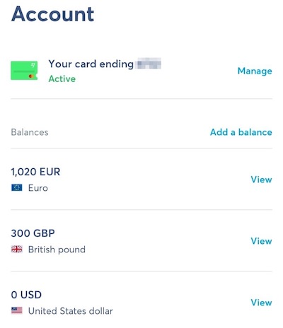
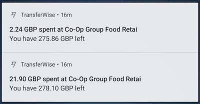
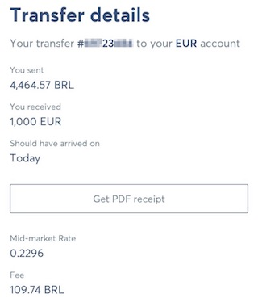

# Transferwise

Olá,

(This post is in portuguese because it's for my Brazilian friends and family).

Como vocês ja me conhecem, sabem que sou uma pessoa ~mão de vaca~ contida, e to sempre procurando um jeito de facilitar as coisas na vida financeira.

## Até logo BB Americas

Quando viemos pra Europa, fiz a conta no BB Americas, foi o melhor procedimento que vi podendo abrir uma conta direto do Brasil, sem ter que ir fisicamente a algum lugar.

O bom do BB Americas foi que houve a possibilidade de compra dólar ao longo do tempo, obtendo um menor preço médio (ano eleitoral é complicado) e ter um cartão de crédito.

ps: Cartão de crédito custa US$ 120 anuais... Depois de um pouco menos de 1 ano de viagem, colocando TODOS os gastos (airbnb e passagens) no cartão, consegui obter um crédito de US$ 175 com o programa de ponto, então até que saiu melhor que o esperado.

O que era bom no passado, é que o BB não cobrava tarifa para envio de dinheiro para o BB Americas, então funcionava da seguinte forma:

1. Dólar Comercial + 1% de spread
2. IOF de 0,38%
3. VET: Dólar Comercial + 1,38%

O problema é que agora começou a colocar uma _módica_ tarifa de 2% isso mesmo, DOIS PORCENTO, para que? para nada!

1. Dólar Comercial + 1% de spread
2. IOF de 0,38%
3. Tarifa: 2%
4. VET: Dólar Comercial + 3,38%

Para piorar, no meu caso, como os gastos são feitos na Europa, o BB Americas ainda cobrava mais 1% de gasto internacional, então meu VET final saindo do Brasil acabava ficando:

1. Cenário sem tarifa: 2,38%
2. Cenário com tarifa: 4,38%

Para quem esta acostumado com retornos financeiros, sabe como é difícil ganhar 1%, 2% a mais.. não da pra deixar isso na mesa.

Um absurdo pensando que é colocado esses 2% apenas para margem do banco, em um serviço digital que anteriormente ja era cobrado sem essa tarifa.

Ai que entra o Transferwise!!

## Olá Transferwise

Transferwise é uma empresa digital, tipo o nubank aqui da Europa, só que o foco deles é a questão cambial, vamos ver como isso esta "salvando".

Para abrir uma conta, entrei em transferwise.com (se você usar o link https://transferwise.com/u/celsof62 terá a primeira transação gratuita e eu ganho um troquinho, todo mundo ganha, que tal? :) )

Mandei uma foto do meu passaporte para validar a identidade e em 2, 3 horas, ja liberaram a conta, dessa forma você pode abrir contas (o que seria a nossa conta corrente), em até 40 cotações, abri 3:

- USD
- EUR
- GBP

(é de graça mesmo :D)

E de brinde ainda sai com informações de banco para transferência, então se alguém nos EUA, Europa ou Reino Unido precisar fazer uma transferência pra você, em poucas horas o saldo esta disponível para usar.

Ok, após esse processo, estava com as contas zeradas, para pedir o cartão precisa de 20 dinheiros de saldo em uma conta, coloquei 20 EUR através do meu Paypal atual (queria que o dinheiro caisse na conta porque queria que o cartão chegasse rápido, mal eu sabia que o TED seria ainda mais rápido, voltaremos nesse assunto).

Coloquei os 20 EUR via Paypal, saldo na conta no dia seguinte, pedi o cartão (em um endereço diferente do meu, pois estava de mudança). Como o cartão é ativado pelo App, é entregue como correspondência normal, sem necessidade de assinatura.

Em 3 dias o cartão chegou no novo endereço. (Empresa UK, pais UK, para outras localidades pode demorar um pouquinho mais). Mas caso esteja de viagem marcada, pode pedir para entregar no seu primeiro destino, funciona perfeitamente.

De posse do cartão, liberado, hora de gastar (mas para isso precisamos de saldo)!

Detalhe, o cartão é contactless, o que é uma BAITA mão na roda, pagamento de transporte público só aceita contactles. O cartão internacional aqui não funciona com Pin, apenas com assinatura, logo tem que carregar o passaporte para conferirem assinatura em todos lugares que vamos. Com contactless, vida fica mais fácil.

## Saldo

Fui verificar o procedimento para colocar saldo (aqui sim a empresa se mostrou INCRÍVEL), solicitei 1000 EUR, a empresa disse que para creditar esse valor eu deveria transferir R$ 4.464,57 para um parceiro brasileiro (ela trabalha com duas casas de câmbio brasileiras, uma no PR e outra em MG, verifiquei no banco central e o cadastro é perfeito).

Fiz o TED do BB para a conta especificada (como tenho conta digital, o TED é R$ 00), e após menos de 2 horas (isso mesmo, 2 HORAS), o dinheiro esta disponível em no transferwise para uso. Pronto para usar, do outro lado do mundo, incrível!

ps: Se tivesse pago por boleto, levaria 2 dias para o dinheiro ser transferido dentro do Brasil hahaha

(quer saber como chegou nesse R$ 4.464,57 ? Veja a comparação de custos abaixo)

Como estou alguns dias no UK, transferi um pouco de Libra (porque passar de EUR -> GBP no transferwise custaria ~ 0,30%), exatamente o mesmo procedimento acima, dinheiro na conta em menos de 2 horas. Fantástico o nível de serviço.

## Utilização

Para evitar o 1% do BB Americas, tentei adicionar o cartão no Paypal, mas como minha conta é brasileira, não deixou adicionar o endereço daqui. Criei uma nova conta no paypal, com o endereço UK e adicionei o transferwise la, resultado? Ativo!

Agora sim, possível utilizar o paypal aqui na Europa sem 1% de sobre tarifa.

Tudo que acontece com o cartão, paypal verificando validade, uso do mesmo, é reportado pelo app no celular, notificação na hora, com o gasto e o saldo restante.

Tive problema do cartão do BB ser bloqueado aqui na Europa por suspeita de fraude (isso porque eu ja estava há 1 mês em Glasgow) e ele simplesmente bloqueou, sexta a noite. Fui conseguir resolver apenas na terça feira, agora com o controle pelo app, não acontece mais.

## Comparativo de Custos

Vamos la, chegou até aqui? Sério? :D

EUR 1000 -> custou R$ 4467,57, como o Transferwise faz?

Tarifa média de mercado 0,2296 = 1 EUR -> 1 4,355400697 BRL (no momento que fiz isso, era EXATAMENTE a mesma cotação mostrada no Google no investing.com).

E tarifa de R$ 109,74 (~ 2,5% do valor enviado), o Transferwise cobra esse valor no Brasil dado nossa estrutura de custo / impostos, se esta nos Estados Unidos e envia para Europa, o custo é de 0,30%. Custo Brasil.

|                | Espécie          | BB Antigo      | BB Novo        | Transferwise |
| -------------- | ---------------- | -------------- | -------------- | ------------ |
| Cotação Câmbio | Comercial + 2,5% | Comercial + 1% | Comercial + 1% | Comercial    |
| IOF            | 0,38%            | 0,38%          | 0,38%          | 0,38%        |
| Tarifa         | R$ 60            | 0              | 2%             | 2,11%        |
| VET US         | 4,18%            | 1,38%          | 3,38%          | 2,49%        |
| VET Europa     | 4,18%            | 2,38%          | 4,38%          | 2,49%        |

ps: Como Espécie é tarifa fixa, simulando os 1.000 EUR, daria 1,30% que foi usado para o VET.

Depois dessa primeira semana utilizando, ja não tenho dúvidas que Transferwise além de mais barato (visto que o cenário BB Antigo ja não existe mais), no que diz respeito a praticidade, facilidade de compra de recursos, transparência (esses percetuais no BB não são explícitos, quebrei aqui para ficar mais fácil mostrar), e facilidade de uso do cartão + aplicativo.

Queria ter descoberto isso antes :D Mas agora passo adiante pra vocês, se quiserem a primeira transfência grátis, não esqueçam, usem o link https://transferwise.com/u/celsof62 e sejam felizes (com menor custo)! :)